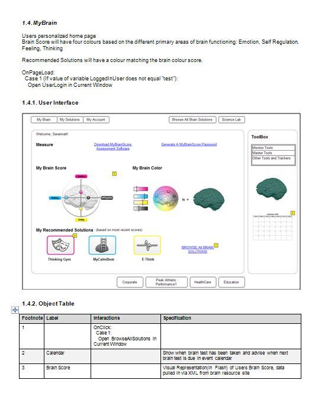
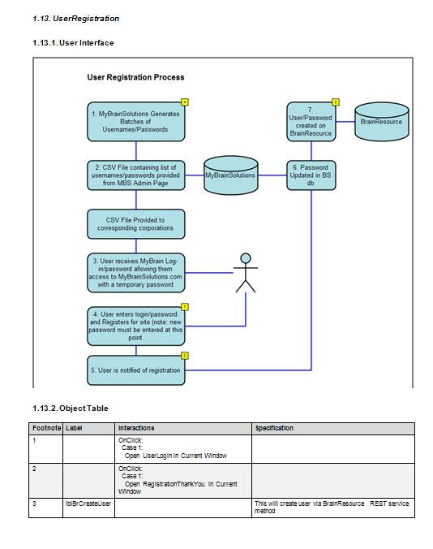

2008

Consulted with neuroscience clients to develop a Brain training portal for people. Designed website architecture, local database design, interface to connect with existing JAVA based system database.

* ASP.Net 3.5 Website Architecture (LINQ, AJAX, Database Design, n-Tiered design)
* Integration with Brain Resource REST interface, and Neurological assessments
* Wireframes, Prototypes, Specifications Documents
* Website Development
* HTML/Flash Integration

